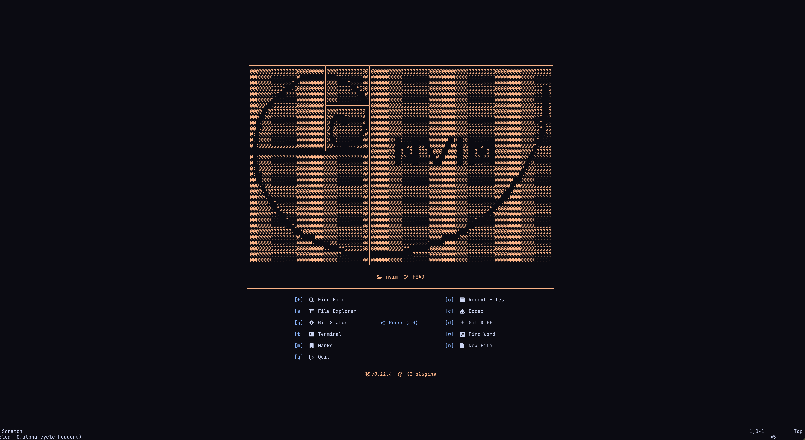

# Sebas' Neovim Config

This repository is my full Neovim 0.10+ configuration. It is built around `lazy.nvim`, it uses a more minimal UI, a lot of temporary floating windows, and the Catppuccin mocha theme.

<p align="center">
  
</p>

## Installation

1. Back up any existing config:
   ```bash
   mv ~/.config/nvim ~/.config/nvim.bak
   ```
2. Clone this repo into your configuration directory:
   ```bash
   git clone https://github.com/Sebastianlbo/nvim ~/.config/nvim
   ```
3. Start Neovim. The bootstrapper automatically installs `lazy.nvim` and all plugin specs listed in `lua/core/plugins` and `lua/add_plugins`.
4. Run the initial sync/update steps:
   ```
   :Lazy sync
   :MasonInstallAll
   ```
5. Restart Neovim after the first sync so that Treesitter parsers, LSP servers, and null-ls sources are picked up.

### Keeping Things Updated

- `:Lazy update` to pull the latest plugin releases pinned in `lazy-lock.json`.
- `:Lazy clean` removes specs you deleted.
- `:Mason` opens the UI for managing external language servers/formatters.
- Update `lazy-lock.json` whenever you intentionally bump plugin versions so the environment stays reproducible.

## Repository Layout

```
init.lua                 -- Bootstraps lazy.nvim, loads utils, mappings, and core options. Add plugin names to `excluded = {}` to turn off without completely deleting them.
lua/core/                -- Default plugins, shared mappings, and base settings. Basically my neovim foundation and identity.
lua/add_plugins/         -- My nice to have plugin specs layered on top of the core set. Easy to just delete or add lua files here to use different set of plugins.
lua/utils/               -- Helpers for bootstrapping, mappings, Mason PATH tweaks, and the custom dashboard UI.
lazy-lock.json           -- Pinned plugin versions for reproducible installs.
LICENSE                  -- MIT license for the configuration.
```

`utils.build_plugin_list` collects every module under `lua/core/plugins` and `lua/add_plugins` (excluding `lazy_nvim`), so dropping a new `<name>.lua` file in either directory automatically registers it the next time you start Neovim. Set the `excluded` table in `lua/core/init.lua` to temporarily skip specific specs without deleting them.

## Extending and Customizing

1. **Add a plugin**: create `lua/add_plugins/<your_plugin>.lua` that returns a valid `lazy.nvim` spec. This keeps personal tweaks separate from the shared core.
2. **Keymaps**: declare mappings inside `lua/core/mappings.lua`. Plugins call `require("utils").load_mappings("<section>")` so the keys land only after the dependency is available.
3. **Overrides**: most specs expose `opts` callbacks, so you can override visuals (Catppuccin, Bufferline, Alpha), file explorer behavior, Telescope pickers, etc. Check with :Telescope help_tags for plugin-specific docs.
4. **External tools**: Mason ensures the LSP binaries listed in `lua/core/plugins/mason.lua`. The null-ls spec in `lua/add_plugins/none-ls.lua` drives format-on-save and will ask Mason to install `checkmake`, `prettier`, `eslint_d`, `shfmt`, `stylua`, and `ruff`. Install any OS-level dependencies (latexmk, Skim, lazygit, ripgrep) yourself.

## Key Mappings

`<leader>` is mapped to `<Space>` in `lua/core/mappings.lua`. Below are the bindings I use more often.

- **Editing & Windows**:

  `<leader>a` snaps focus to the top-most, left-most split (main editing/working window),

  `<Esc>` clears `/` highlights, enters normal mode (incl. term), exits most plugins or floating windows,

  `<leader>i` toggles the floating terminal,

  `<leader>v` toggles a vertical split terminal,

  `leader>ss` sends the current line or visual selection to the terminal (used with iPython),

  `<leader>sh` split horizontally,

  `<leader>sv` split vertically,

  `<C-h>`, `<C-j>`, `<C-k>`, `<C-l>` navigate between splits.

  `<leader>n` / `<leader>e` to respectively toggle/focus floating `nvim-tree` when you want to search project manually.

- **Files & Search (Basically Telescope)**:

  `<leader>tj` telescope finds files,

  `<leader>ta` telescope all (includes dotfiles/ignored files),

  `<leader>tw` telescope live-grep,

  `<leader>tx` telescope grep-searches only open buffers,

  `<leader>td` telescope diagnostics,

  `<leader>tm` telescope marks,

  `<leader>to` telescope recent files,

  `<BS><leader>`/`<leader><BS>`/\_ telescope grep-searches only open buffers,

- **Git Workflow**:

  `<leader>gs` launches LazyGit,

  `[c` and `]c` jump between hunks,

  `<leader>hs`/`<leader>hu` stage or undo the current hunk,

  `<leader>hd` previews it,

  `<leader>gb` shows full-line blame,

  `<leader>gtb` toggles inline blame,

  `<leader>gdt` diffs the current file with split view,

  `<leader>gda` Nice UI to see all changes in the repo,

  `<leader>gds` Nice UI to see all staged changes.

- **LSP Navigation**:

  `<leader>gD` go to declaration,

  `<leader>gd` go to definition,

  `<leader>gi` go to implementation,

  `<leader>lr` rename variable in project (all references),

- **Utilities**:

  `<leader>/` toggles comments via `Comment.nvim`,

  `<leader>u` pops open Undotree,

  `<leader>cc` toggles the Codex assistant sidebar

## License

Released under the MIT License. See `LICENSE` for details.
